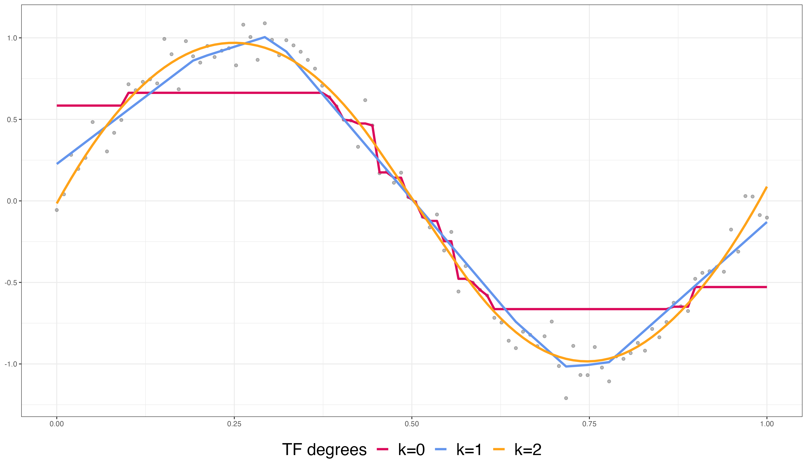
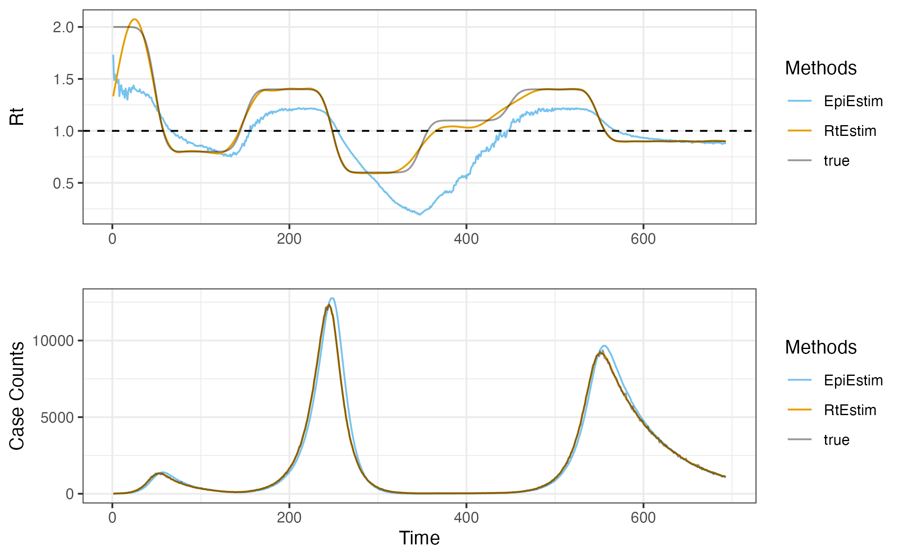
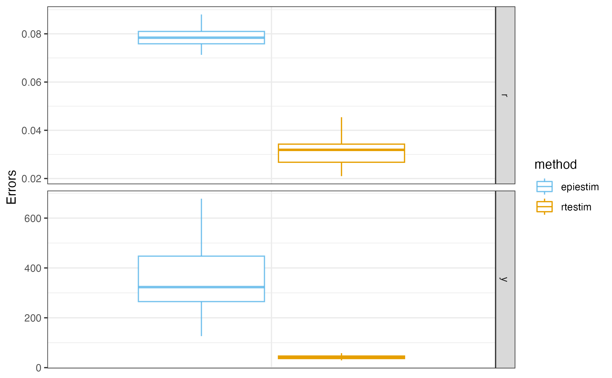
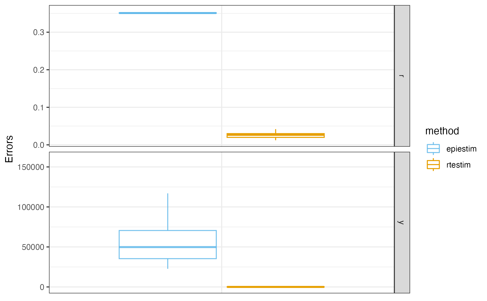
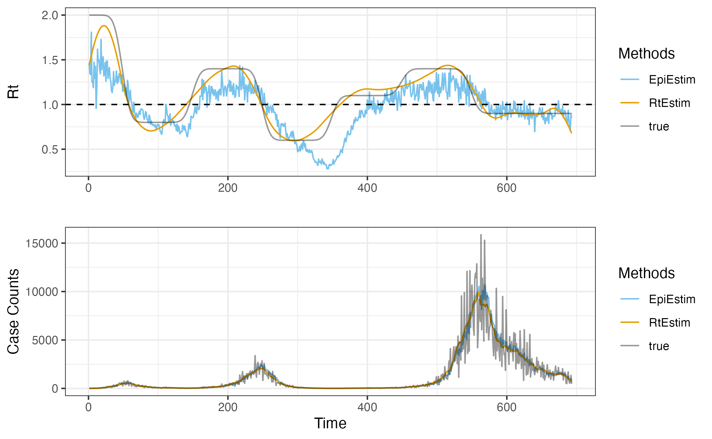
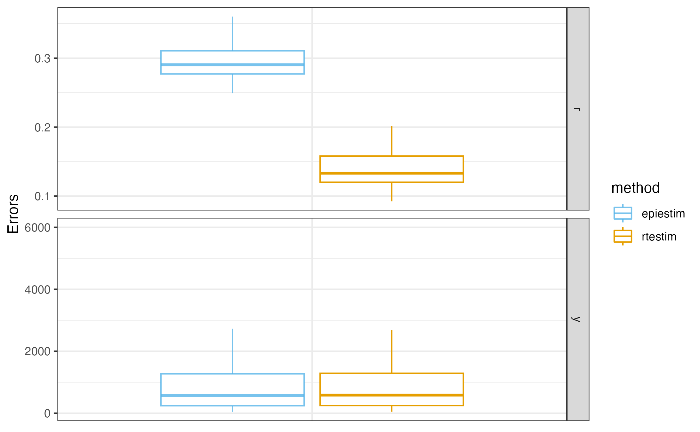
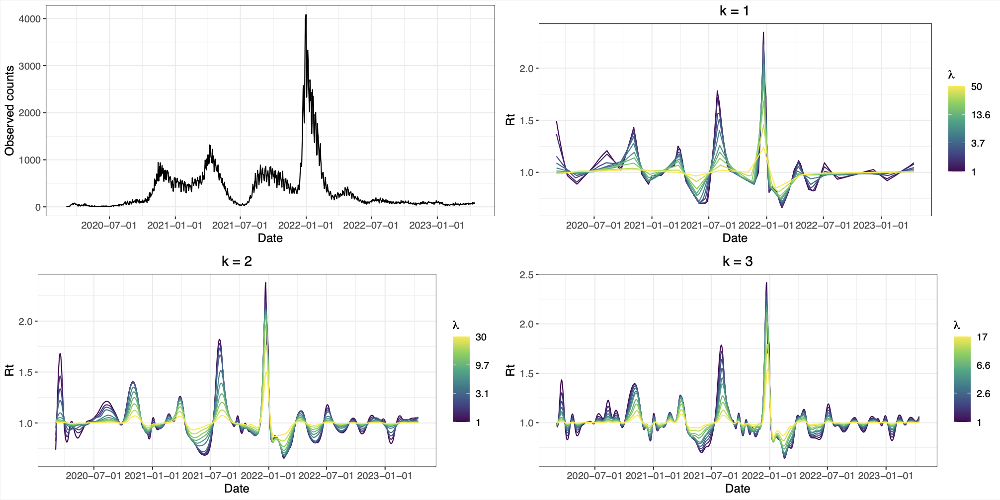

```{r setup, include=FALSE}
library(tidyverse)
library(lubridate)
library(fontawesome)
options(htmltools.dir.version = FALSE)
knitr::opts_chunk$set(
  dev = "svg",
  fig.path = "gfx/",
  fig.align = "center",
  fig.width = 9, fig.height = 3.5, fig.retina = 3,
  fig.showtext = TRUE,
  out.width = "100%",
  cache = TRUE,
  autodep = TRUE,
  echo = FALSE,
  message = FALSE,
  warning = FALSE,
  hiline = TRUE
)
```

```{r xaringan-themer, include=FALSE, warning=FALSE}
library(xaringanthemer)
primary <- "#002145"
secondary <- "#6495ed"
tertiary <- "#ffa319"
fourth_color <- "#DB0B5B"

style_duo_accent(
  primary_color = primary, # "#002145", # UBC primary
  secondary_color = secondary, # "6EC4E8", # UBC secondary 4
  header_font_google = google_font("EB Garamond"),
  text_font_google = google_font("Open Sans"),
  code_font_google = google_font("Fira Mono"),
  text_color = primary,
  table_row_even_background_color = lighten_color(primary, 0.8),
  colors = c(
    tertiary = tertiary, fourth_color = fourth_color,
    light_pri = lighten_color(primary, 0.8),
    light_sec = lighten_color(secondary, 0.8),
    light_ter = lighten_color(tertiary, 0.8),
    light_fou = lighten_color(fourth_color, 0.8)
  ),
  outfile = here::here("src/xaringan-themer.css")
)
# theme_set(theme_xaringan())
```

layout: true

---

background-image: url("gfx/bg.png")
background-size: 78%
background-position: right bottom

## Effective reproduction number estimation with trend filtering

#### Jiaping(Olivia) Liu<sup>1</sup>, Zhenglun Cai<sup>2</sup>, Paul Gustafson<sup>1</sup>, Daniel J. McDonald<sup>1</sup>. <br> Department of Statistics<sup>1</sup> and Centre for Health Evaluation and Outcome Sciences<sup>2</sup>, UBC. <br> July 21, 2023.

<br/><br/><br/><br/><br/><br/><br/><br/><br/><br/>

---

## Modelling the effective reproduction number $\mathcal{R}_t$ 

- $\mathcal{R}_t$ (at time $t$) is the expected number of <span style="color: orange;">secondary</span> infections caused by a <span style="color: orange;">primary</span> infection in a population. 

--

- Let $\mathcal{R}_t = \frac{N_t / c}{\sum_{i=1}^{\Phi_t} p_i (N_{t-i}/c)}$, where 

  - Assume a constant rate $c$ of observed infections over all infections. 
  
--
  
  - <span style="color: orange;">Secondary</span> cases: $N_t/c$ is the *true* number of all infected cases at time $t$ and $N_t$ is the *observed* one. 
  
--
  - <span style="color: orange;">Primary</span> cases: 
  <!-- weighted sum of infections in the past few observations (from time $t-1$ to $t-\Phi_t$). -->
  
      - $\sum_{i=1}^{\Phi_t} p_i (N_{t-i}/c)$ is the *true* total **infectious** cases at $t$ and $\sum_{i=1}^{\Phi_t} p_i N_{t-i}$ is the *observed* total. <!-- (that are confirmed prior to $t$) -->

--
      - $p_i$ is the probability of generation time (between infections), approximated by serial interval (between symptom onsets). 
      
          - Assume the independence between the serial interval $p_i$ and calendar time $t$.

$\DeclareMathOperator*{\argmin}{argmin}$

---
## Modelling the effective reproduction number $\mathcal{R}_t$

- $N_t = \sum_{i=1}^{\Phi_t} p_i\mathcal{R}_t N_{t-i}$ is the well-known ***renewal equation***, where $p_i \mathcal{R}_t$ represents the infectiousness at $i$. 
--

- Assume the observed daily infections $y_t \sim Pois(N_t)$ at $t$.
  
  - Let $w_t := \sum_{i=1}^{\Phi_t} p_i N_{t-i}$.
  
  - Renewal equation is $N_t = w_t \mathcal{R}_t$, and then $y_t \sim Pois(w_t \mathcal{R}_t)$.
  
  - Assume <span style="color: orange;">serial interval</span> is known and follows a Gamma distribution.
  
---

## Modelling the effective reproduction number $\mathcal{R}_t$

The probability $p$ is a theoretical probability of (discretized) serial interval between a certain period (e.g., a day). 

```{r echo=TRUE}
hist(rgamma(1e3L, 2.5, scale=2.5), prob=T, main="Density of Gamma distribution with shape = 2.5, scale = 2.5", xlab="", ylim=c(0,.13), breaks=30)
curve(dgamma(x, shape = 2.5, scale = 2.5), add=T, col="#ffa319", lwd=2)
```

<!-- Find the probabilities between discretized intervals corresponding to the time prior to $t$, and then reweighted the probabilities by their sum so they have the sum of one. -->

---
## Modelling the effective reproduction number $\mathcal{R}_t$

- <span style="color: gray;"> $N_t = \sum_{i=1}^{\Phi_t} p_i\mathcal{R}_t N_{t-i}$ is the well-known renewal equation, where $p_i \mathcal{R}_t$ represents the infectiousness at $i$.</span>

- <span style="color: gray;">Assume the observed daily infections $y_t \sim Pois(N_t)$ at time $t$.
</span>

  - <span style="color: gray;"> Let $w_t := \sum_{i=1}^{\Phi_t} p_i N_{t-i}$, which is the weight sum of infections prior to time $t$. </span>
  
  - <span style="color: gray;"> $N_t = w_t \mathcal{R}_t$, and then $y_t \sim Pois(w_t \mathcal{R}_t)$.</span>
  
  - <span style="color: gray;"> Assume serial interval function follows a Gamma distribution.
</span>

      - Given $\Phi_t$, reweight $p_i$ by $\sum_{i=1}^{\Phi_t} p_i= 1$ for each infected individual. 
      - Approximate $w_t$ by $\sum_{i=1}^{\Phi_t} p_i y_{t-i}$.

---
## Modelling the effective reproduction number $\mathcal{R}_t$

- Given $y_t$ and $w_t$ for all $t$, estimate $\mathcal{R}_t$? 

  - Maximize the likelihood of joint distribution of $\mathcal{R}_t$, i.e., $\prod_{t=1}^n \mathbb{P}(\mathcal{R}_t \mid y_t, w_t)$.
    
      - Let $\theta_t := \log(\mathcal{R}_t) \in \mathbb{R}$. Maximize $\sum_{t=1}^n y_t \theta_t - w_t e^{\theta_t}$.

--

  - Temporal evolution of $\mathcal{R}_t$? 
  
      - Regularize similarity (divided differences) across neighboring $\theta_j$, $j=t,...,t-k-1$ for an arbitrary degree  $k=0,1,\dots$. 
      
        - Trend filtering penalty ${\left\lVert D^{(k+1)} \theta\right\rVert}_1$, where the divided difference operator $D^{(k+1)}$ is a banded matrix. 
      
        - $\ell_1$ penalty: Local adaptivity, i.e., heterogeneous smoothness. 

        - Divided difference & banded operator: low computational cost.

<!-- (i.e., binomial coefficients of $k+1 \choose j$ for $j=0,...,k+1$) --> 

---
## Modelling the effective reproduction number $\mathcal{R}_t$

<div style="display: flex; justify-content: center;">
  
</div>

### Various orders of divided differences results in different levels of smoothness. 

---
## Modelling the effective reproduction number $\mathcal{R}_t$

Divided difference operator is a banded matrix with shrinking numbers of rows for higher degrees $k=0,1,\dots$

--

.pull-left[
For example, $D^{(1)}$ and $D^{(2)}$ are respectively  
```{r}
mat <- diff(diag(5))
print(mat)

mat <- diff(diff(diag(5)))
print(mat)
```
]

--

.pull-right[
Each row of order $k+1$ defines the $(k+2)$nd row in Yanghui's or Pascal's triangle  with alternating signs.

]

---
## Modelling the effective reproduction number $\mathcal{R}_t$

Let $\theta_t := \log(\mathcal{R}_t) \in \mathbb{R}$. Given $w_t$ and $y_t$, we define the model as 
$$\hat{\theta} = \underset{\theta\in\mathbb{R}^n}{\argmin} \frac{1}{n}\sum_{t=1}^n -y_t \theta_t + w_t e^{\theta_t} + \lambda {\left\lVert D^{(k+1)} \theta \right\rVert}_1$$
with an arbitrary order $k=0,1,2,\dots$ and tuning parameter $\lambda$.

<!--  - Divided difference matrix $D^{(k+1)}$ defines the divided differences across neighboring $\theta_t$s. -->

--

### * Trend filtering with Poisson loss on univariate data

- Convex (proximal) optimization problem with a global optimum.

- Solve it by proximal Newton method. 

<!-- - For example, $k=0$ corresponds to ${\left\lVert \theta_{t-1} - \theta_t \right\rVert}$, and $k=1$ corresponds to ${\left\lVert \theta_{t-2} -2\theta_{t-1} + \theta_t \right\rVert}$. -->

---
## Solving the trend filtering with Poisson loss

Approximation (Newton's method) + decomposition (specialized ADMM).

--

At iterate $t+1$: 

- Approximate the Poisson loss and solve the *weighted Gaussian trend filtering* $$\theta^{t_+} :=  \underset{\theta\in\mathbb{R}^n}{\arg\min} \frac{1}{2n} {\left\lVert \theta - c^{t} \right\rVert}_{W^t}^2 + \lambda {\left\lVert D^{(k+1)}\theta \right\rVert}_1,$$ where $a^T W a := {\lVert a \rVert}_W^2$, $c^t$ is the Gaussianized data and $W^t$ is the weight. ***Solve it using specialized ADMM [Ramdas et al., 2016].***

--

- Backtracking linesearch: $${\theta}^{t+1} \leftarrow {\theta}^t + s^{t+1} ({\theta}^{t_+} - {\theta}^t),$$ where $s^{t+1}$ is the step size.

- Convergence of objectives.

---
## Empirical comparison using synthetic data with EpiEstim

### Experimental design

- Generate signal $y_t$ from $y_t \sim Pois(N_t)$.

  - Compute true means $N_t$ using renewal equation using $N_t = \sum_{i=1}^{\Phi_t} p_i\mathcal{R}_t N_{t-i}$ given $N_1=2$ and $\Phi_t=t-1$.
  
  - $\mathcal{R}$ follows a step function applied by boxcar kernel of length 10 for 10 times. 
  
  - Suppose serial interval follows Gamma with scale 2.5 and shape 2.5. 
  
- Generate $30$ repeated samples of length $700$. 

--

- What if assumptions are violated?   
      - *Synthetic data 2* (when smoothing assumption is violated): $\mathcal{R}$ follows a step function without boxcar kernel transformation.
      
      - *Synthetic data 3* (when Poisson assumption is violated): $y_t$ follows $NB(N_t, r)$, where $r$ is the overdispersion parameter.Let $N_1=8, r=8$.

---
## Empirical comparison using synthetic data with EpiEstim

### Evaluation metrics

- Compute $\hat{\mathcal{R}}$ and compute 
  
  - Rooted mean squared error (RMSE): $\sqrt{(\hat{\mathcal{R}} − R_{true})^2}/n$.

- Compute $\hat{N}$ using $\hat{\mathcal{R}}$ and renewal equation, and compare

  - Rooted mean absolute error (RMAE): ${\left\lvert \hat{N} - N \right\rvert}_1 / n$.

### Settings of EpiEstim 

- EpiEstim estimates $\mathcal{R}_t$ using a Bayesian framework assuming Poisson incidences and Gamma prior of $\mathcal{R}_t$. 

- EpiEstim’s depends on a sliding window. We use length 7. 


---
## Empirical comparison using synthetic data with EpiEstim

### *Synthetic data 1*

.pull-left[
Display an example case.

<div style="display: flex; justify-content: left;">

</div>
]

.pull-right[
Prediction error (RMSE above and RMAE below) over 30 repeated samples.

<div style="display: flex; justify-content: right;">

</div>
]

---
## Empirical comparison using synthetic data with EpiEstim

### *Synthetic data 2* (when smoothing assumption is violated)

.pull-left[
Display an example case.

<div style="display: flex; justify-content: left;">

</div>
]

.pull-right[
Prediction error (RMSE above and RMAE below) over 30 repeated samples.

<div style="display: flex; justify-content: right;">

</div>
]

---
## Empirical comparison using synthetic data with EpiEstim

### *Synthetic data 3* (when Poisson assumption is violated)

.pull-left[
Display an example case.

<div style="display: flex; justify-content: left;">

</div>
]

.pull-right[
Prediction error (RMSE above and RMAE below) over 30 repeated samples.

<div style="display: flex; justify-content: right;">

</div>
]

---
## Empirical comparison using synthetic data with EpiEstim

### <span style="color: gray;"> Evaluation metrics </span>

- <span style="color: gray;"> Compute $\hat{\mathcal{R}}$ and compute </span>
  
  - <span style="color: gray;"> Rooted mean squared error (RMSE): $\sqrt{(\hat{\mathcal{R}} − R_{true})^2}/n$.</span>

- <span style="color: gray;"> Compute $\hat{N}$ using $\hat{\mathcal{R}}$ and renewal equation, and compare </span>

  - <span style="color: gray;"> Rooted mean absolute error (RMAE): ${\left\lvert \hat{N} - N \right\rvert}_1 / n$. </span>

### Main findings 

- RtEstim outperforms EpiEstim in terms of accuracy of effective reproduction number estimation. 

- RtEstim is robust in the violation of smoothness and distributional assumptions. 

---
## Covid-19 data application

Covid-19 daily confirmed counts between March 1st, 2020 and April 15th, 2023 in British Columbia, Canada. 
Data is available as of May 18, 2023 reported by B.C. Center of Disease Control. 

.pull-left-narrow[
If $\mathcal{R}\geq 1$,
the infections expand.

If $\mathcal{R}< 1$,
the pandemic dies out.
]

.pull-right-wide[

]

---
## Discussions

- Imputation of missing values? 

  - Linear interpolation for NAs missting at random.

- Select hyperparameter $\lambda$?

  - Leave-every-k-th-out cross validation.

- Compute for $\lambda$ sequences? 

  - Path algorithm for descending $\lambda$ sequences.

---

class: center, middle

# Thank you for listening!

